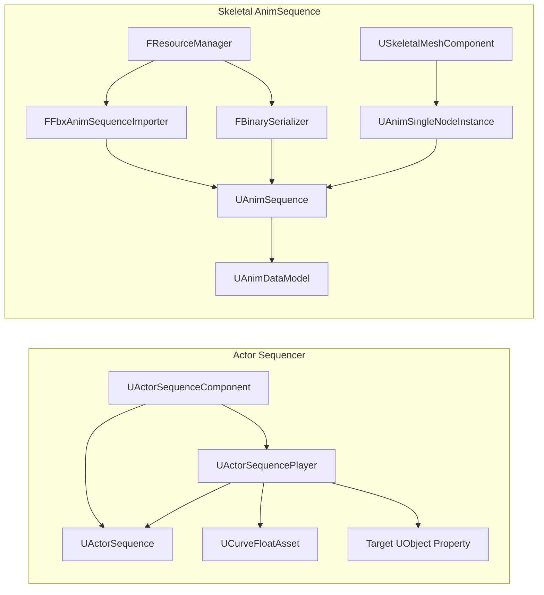
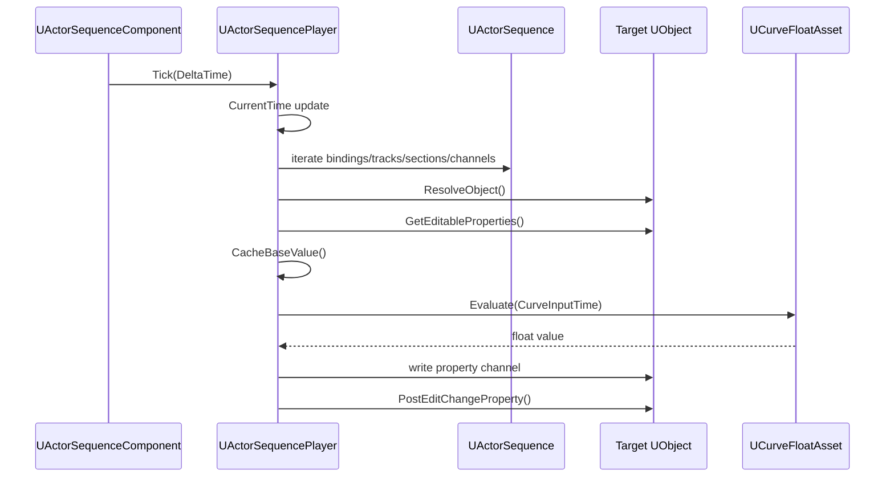
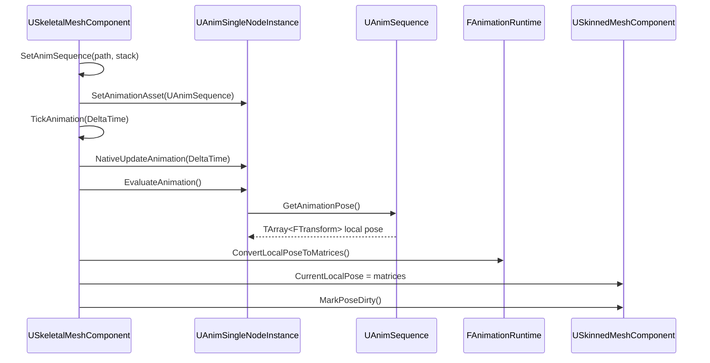

# Anim Sequencer Guide

이 문서는 현재 `anim sequencer` 관련 작업 결과를 다른 작업자가 바로 이어서 볼 수 있게 정리한 문서다.

핵심은 두 시스템을 구분하는 것이다.

| 이름 | 역할 | 대표 클래스 |
| --- | --- | --- |
| Actor Sequencer | actor/component의 일반 property를 timeline curve로 제어 | `UActorSequence`, `UActorSequenceComponent` |
| Skeletal AnimSequence | FBX AnimStack을 skeletal mesh bone pose로 재생 | `UAnimSequence`, `UAnimDataModel` |

둘 다 "시간을 넣으면 값을 평가한다"는 점은 같지만, 적용 대상이 다르다.

- Actor Sequencer는 `float`, `FVector.X`, `FColor.R` 같은 property 값을 바꾼다.
- Skeletal AnimSequence는 bone local transform 배열을 만들어 skinning pose에 적용한다.

---

## 1. 빠른 요약

### Actor Sequencer가 하는 일

`UActorSequenceComponent`가 actor에 붙고, 그 안의 `UActorSequence`가 timeline 데이터를 가진다.

재생할 때는 `UActorSequencePlayer`가 다음 순서로 동작한다.

1. 현재 sequence time을 갱신한다.
2. binding으로 target object를 찾는다.
3. track의 property path로 property를 찾는다.
4. section/channel의 curve를 평가한다.
5. 평가된 float 값을 target property에 쓴다.

예:

```text
PointLightComponent.Intensity
  section 0.0s ~ 2.0s
  curve value 0.0 -> 10.0
```

재생 결과:

```text
time 0.0 : Intensity = 0.0
time 1.0 : Intensity = 5.0
time 2.0 : Intensity = 10.0
```

### Skeletal AnimSequence가 하는 일

FBX의 AnimStack을 읽어 `UAnimSequence`로 만든다.

재생할 때는 다음 순서로 동작한다.

1. `FResourceManager::LoadAnimSequence()` 호출
2. binary cache가 있으면 cache load
3. 없으면 FBX AnimStack sampling
4. `UAnimDataModel`에 bone track 저장
5. `UAnimSingleNodeInstance`가 현재 시간의 pose 평가
6. `USkeletalMeshComponent`가 pose를 `CurrentLocalPose`에 적용

---

## 2. 전체 구조



읽는 순서:

1. Actor Sequencer 문제면 `UActorSequenceComponent -> UActorSequencePlayer -> UActorSequence` 순서로 본다.
2. Skeletal animation 문제면 `FResourceManager -> FbxAnimSequenceImporter/BinarySerializer -> UAnimSequence -> SkeletalMeshComponent` 순서로 본다.

---

## 3. Actor Sequencer

### 3.1 핵심 파일

| 파일 | 책임 |
| --- | --- |
| `Source/Engine/Animation/ActorSequence.h` | sequence data 구조 정의 |
| `Source/Engine/Animation/ActorSequence.cpp` | serialize, track resolve, playback, property apply |
| `Source/Engine/Animation/CurvePlayback.h/.cpp` | curve 시간 변환과 curve 평가 |
| `Source/Engine/Component/ActorSequenceComponent.h/.cpp` | actor에 붙는 component, runtime/preview player 소유 |
| `Source/Editor/UI/EditorActorSequenceDetails.cpp` | property panel의 Actor Sequence 설정 UI |
| `Source/Editor/UI/EditorActorSequencerWidget.cpp` | timeline editor UI |
| `Source/Editor/UI/EditorActorSequenceEditModel.cpp` | editor에서 sequence data를 수정하는 helper |
| `Source/Editor/UI/EditorActorSequenceTimeUtils.h` | sequence time과 curve time 변환 |

### 3.2 데이터 구조

```text
UActorSequenceComponent
  - UActorSequence* Sequence
  - UActorSequencePlayer* SequencePlayer
  - UActorSequencePlayer* PreviewSequencePlayer
  - bAutoPlay
  - bPauseAtEnd
  - PlayRate
  - StartOffsetSeconds

UActorSequence
  - StartTime
  - Duration
  - bLoop
  - Bindings[]

FActorSequenceBinding
  - BindingGuid
  - TargetObjectGuid
  - TargetObjectName
  - Tracks[]

FActorSequenceTrack
  - TrackGuid
  - PropertyPath
  - TrackType
  - Sections[]

FActorSequenceSection
  - SectionGuid
  - StartTime
  - Duration
  - PlayRate
  - bLoop
  - Channels[]

FActorSequenceChannel
  - ChannelName
  - Playback
    - CurveAssetPath
    - Curve
    - TimeMappingMode
    - ApplyMode
```

중요한 기준:

- binding은 "어떤 object인가"를 저장한다.
- track은 "어떤 property인가"를 저장한다.
- section은 "언제부터 언제까지 재생하는가"를 저장한다.
- channel은 "property의 어떤 scalar 값인가"를 저장한다.

예:

```text
TargetObjectName = PointLightComponent_0
PropertyPath     = LightColor
ChannelName      = R
```

이 경우 `PointLightComponent_0.LightColor.R` 값을 curve로 제어한다.

### 3.3 재생 흐름



실제 함수 기준:

```text
UActorSequenceComponent::TickComponent()
  -> UActorSequencePlayer::Tick()
    -> ResolveTracks()          // 필요할 때만
    -> Evaluate(CurrentTime)
      -> FCurvePlaybackEvaluator::Evaluate()
      -> ApplyFloat()
```

### 3.4 Target object 찾는 방식

`UActorSequencePlayer::ResolveObject()`가 target object를 찾는다.

순서:

1. owner actor 이름이 `TargetObjectName`과 같으면 owner actor
2. owner actor의 component 중 `PersistentGuid == TargetObjectGuid`인 component
3. owner actor의 component 중 이름이 `TargetObjectName`과 같은 component

따라서 가장 안정적인 기준은 component의 persistent guid다.

문제가 생기는 경우:

- component가 삭제됨
- component 이름이 바뀜
- duplicate 후 guid가 재생성되지 않음
- binding이 다른 actor의 component를 가리킴

### 3.5 Property 찾는 방식

`UActorSequencePlayer::ResolveProperty()`가 target object의 editable property를 찾는다.

조건:

- object가 살아 있어야 한다.
- `Track.PropertyPath`가 비어 있으면 안 된다.
- object의 `GetEditableProperties()`에 해당 이름의 property가 있어야 한다.
- `FPropertyDescriptor.ValuePtr`가 유효해야 한다.
- property type과 channel name이 맞아야 한다.

지원 channel:

| Property type | Channel |
| --- | --- |
| `bool` | `Value` |
| `int32` | `Value` |
| `float` | `Value` |
| `FVector` | `X`, `Y`, `Z` |
| `FVector4` | `X`, `Y`, `Z`, `W` |
| `FColor` | `R`, `G`, `B`, `A` |

### 3.6 Curve time 계산

`FCurvePlaybackEvaluator::Evaluate()`가 시간을 변환한다.

기본 계산:

```cpp
LocalTime = (SequenceTime - Section.StartTime) * Section.PlayRate;
```

`TimeMappingMode`:

| 값 | 의미 | 사용 상황 |
| --- | --- | --- |
| `CurveTime` | curve key time을 초 단위로 그대로 사용 | curve가 실제 시간을 직접 가질 때 |
| `NormalizedTime` | `LocalTime / Duration`으로 0..1 구간 사용 | section 길이에 맞게 curve를 늘려 쓸 때 |

`ApplyMode`:

| 값 | 계산 |
| --- | --- |
| `Absolute` | `Result = CurveValue` |
| `Additive` | `Result = BaseValue + CurveValue` |
| `Multiply` | `Result = BaseValue * CurveValue` |

### 3.7 Editor 수정 흐름

```text
EditorActorSequencerWidget
  - UI 입력 처리
  - 어떤 track/key/section을 수정할지 결정

EditorActorSequenceEditModel
  - 실제 sequence data 수정
  - undo snapshot 처리
  - SequenceComp->MarkSequenceDirty()
  - scene dirty 처리

UActorSequencePlayer
  - 다음 evaluate 때 dirty 상태면 ResolveTracks() 다시 수행
```

수정 작업을 추가할 때 규칙:

- UI 코드에서 sequence data를 직접 고치지 않는 것이 좋다.
- 가능하면 `FEditorActorSequenceEditModel`에 helper를 추가한다.
- data를 바꾼 뒤에는 `NotifySequenceEdited()` 또는 `MarkSequenceDirty()`를 호출한다.
- undo가 필요한 작업은 수정 전에 `CaptureSequenceUndo()`를 호출한다.

---

## 4. Skeletal AnimSequence

### 4.1 핵심 파일

| 파일 | 책임 |
| --- | --- |
| `Source/Engine/Animation/AnimTypes.h` | raw key track 구조 |
| `Source/Engine/Animation/AnimDataModel.h/.cpp` | raw animation data model |
| `Source/Engine/Animation/AnimSequence.h/.cpp` | animation asset, pose evaluate |
| `Source/Engine/Animation/AnimSingleNodeInstance.h/.cpp` | 단일 animation asset 재생 상태 |
| `Source/Engine/Animation/AnimationRuntime.h/.cpp` | bind pose 생성, transform pose를 matrix pose로 변환 |
| `Source/Engine/Asset/FbxAnimSequenceImporter.h/.cpp` | FBX AnimStack import |
| `Source/Engine/Asset/FbxImporter.h/.cpp` | importer facade |
| `Source/Engine/Asset/BinarySerializer.h/.cpp` | anim sequence binary save/load |
| `Source/Engine/Core/ResourceManager.h/.cpp` | anim sequence memory/binary cache 관리 |
| `Source/Engine/Core/AssetPathPolicy.h/.cpp` | anim sequence cache path 생성 |
| `Source/Engine/Component/SkeletalMeshComponent.h/.cpp` | animation asset을 component pose에 적용 |

### 4.2 데이터 구조

```text
UAnimationAsset
  -> UAnimSequenceBase
    -> UAnimSequence
      - AnimStackName
      - AssetPath
      - SourceFbxPath
      - TargetSkeletonPath
      - USkeleton* Skeleton
      - UAnimDataModel* DataModel

UAnimDataModel
  - SequenceLength
  - FrameRate
  - NumberOfFrames
  - BoneAnimationTracks[]

FAnimationTrack
  - BoneName
  - BoneIndex
  - FRawAnimSequenceTrack

FRawAnimSequenceTrack
  - PosKeys[]
  - RotKeys[]
  - ScaleKeys[]
  - PosKeyTimes[]
  - RotKeyTimes[]
  - ScaleKeyTimes[]
```

설계 의도:

- `UAnimSequence`는 asset shell이다.
- 실제 raw key는 `UAnimDataModel`에 둔다.
- runtime은 `UAnimSequence::GetAnimationPose()`로 local pose를 평가한다.
- 추후 compression을 넣으려면 `UAnimDataModel` 옆에 runtime compressed data를 추가하면 된다.

### 4.3 Import/cache 흐름

```text
FResourceManager::LoadAnimSequence(SourceFbxPath, TargetSkeletalMeshPath, AnimStackName)
  -> memory cache 확인
  -> binary cache path 생성
  -> binary header 유효성 확인
  -> valid면 BinarySerializer.LoadAnimSequence()
  -> invalid면 FFbxImporter.LoadAnimSequence()
    -> FFbxAnimSequenceImporter.LoadAnimSequence()
      -> FBX AnimStack 선택
      -> target skeleton bone 이름으로 FBX bone node 매칭
      -> frame별 EvaluateLocalTransform(Time)
      -> translation / quaternion / scale key 저장
  -> BinarySerializer.SaveAnimSequence()
  -> memory cache 등록
```

cache key:

```text
SourceFbxPath | TargetSkeletalMeshPath | AnimStackName
```

세 값 중 하나라도 다르면 다른 animation으로 취급한다.

### 4.4 Runtime 재생 흐름



실제 함수 기준:

```text
USkeletalMeshComponent::SetAnimSequence()
  -> FResourceManager::LoadAnimSequence()
  -> SetAnimation(UAnimationAsset*)

USkeletalMeshComponent::TickAnimation()
  -> UAnimSingleNodeInstance::NativeUpdateAnimation()
  -> UAnimSingleNodeInstance::EvaluateAnimation()
    -> UAnimSequence::GetAnimationPose()
  -> USkeletalMeshComponent::ApplyAnimationLocalPose()
```

### 4.5 Pose 평가 규칙

`UAnimSequence::GetAnimationPose()`는 다음 규칙으로 pose를 만든다.

1. target mesh bone count만큼 `OutLocalPose`를 만든다.
2. 기본값은 각 bone의 bind local transform이다.
3. track이 있는 bone만 key를 평가해서 덮어쓴다.
4. translation/scale은 linear interpolation이다.
5. rotation은 quaternion slerp다.
6. loop 재생이면 `SequenceLength` 기준으로 time을 wrap한다.

중요:

- animation track은 bone local transform 기준이다.
- 기존 skinning pose는 `FMatrix` 배열이다.
- animation evaluate 단계에서는 `FTransform` 배열을 쓰고, component 적용 직전에 `FMatrix`로 변환한다.
- row-vector 규약을 유지한다.

### 4.6 Quaternion 규칙

import 시:

- `FbxAMatrix Local = BoneNode->EvaluateLocalTransform(Time)`
- `FbxQuaternion Q = Local.GetQ()`
- `FQuat`로 변환
- normalize
- 이전 key와 dot이 음수면 현재 key를 반전

evaluate 시:

- `FQuat::Slerp(A, B, Alpha)` 사용
- `FQuat::Slerp()` 내부에서 second key인 `B`를 반전해 shortest arc를 처리한다.
- evaluate 코드에서 첫 번째 key를 뒤집으면 안 된다.

문제 증상:

- bone이 갑자기 180도 튄다.
- 같은 pose인데 interpolation 중에 반대로 돈다.

확인 위치:

- `FbxAnimSequenceImporter.cpp`
- `AnimSequence.cpp`
- `Math/Quat.cpp`

---

## 5. Lua/API 사용법

### 5.1 Actor Sequence

```lua
local seq = actor:GetActorSequenceComponent()

seq:SetLooping(true)
seq:SetPlayRate(1.0)
seq:SetPauseAtEnd(false)
seq:SetStartOffsetSeconds(0.0)

seq:Play()
seq:Pause()
seq:Stop()
```

주의:

- runtime player와 editor preview player는 다르다.
- editor preview에서 움직인다고 runtime auto play가 보장되는 것은 아니다.
- runtime 재생은 `BeginPlay()`와 component tick이 필요하다.

### 5.2 Skeletal AnimSequence

```lua
local skel = actor:GetSkeletalMeshComponent()

skel:SetAnimSequence(
    "Asset/SkeletalMesh/Dragon_Baked_Actions_fbx_6.1_ASCII.fbx",
    "Run_New"
)
skel:PlayAnim(true)
skel:SetAnimTime(0.5)
skel:StopAnim()
```

값 의미:

| 값 | 의미 |
| --- | --- |
| `SourceFbxPath` | animation stack이 들어 있는 FBX path |
| `TargetSkeletalMeshPath` | component에 설정된 skeletal mesh path |
| `AnimStackName` | FBX 안의 stack 이름. 예: `Run_New` |

`SetAnimSequence()`에서는 target skeletal mesh path를 component의 current skeletal mesh에서 가져온다.

---

## 6. 문제별 확인 위치

### 6.1 Actor Sequencer

| 증상 | 먼저 볼 곳 | 확인할 것 |
| --- | --- | --- |
| Sequencer 창이 안 열림 | `EditorActorSequenceDetails.cpp`, `EditorActorSequencerWidget.cpp` | `SequenceComp`가 live 상태인지 |
| Add Track 목록에 property가 없음 | `EditorActorSequenceEditModel::CollectAnimatableScalarProperties()` | `GetEditableProperties()`, `ValuePtr`, property type |
| Track은 있는데 값이 안 바뀜 | `UActorSequencePlayer::ResolveTracks()` | object/property/curve resolve 성공 여부 |
| 특정 channel만 안 바뀜 | `GetScalarChannelValue()`, `SetScalarChannelValue()` | channel name과 property type |
| preview는 되는데 runtime 안 됨 | `UActorSequenceComponent::BeginPlay()`, `TickComponent()` | `bAutoPlay`, player tick 여부 |
| Stop 후 원래 값 복구 안 됨 | `ClearAppliedValues()` | base value cache 여부 |
| duplicate 후 다른 component를 움직임 | `ResolveObject()` | `PersistentGuid`, `TargetObjectName` |

### 6.2 Skeletal AnimSequence

| 증상 | 먼저 볼 곳 | 확인할 것 |
| --- | --- | --- |
| AnimStack을 못 찾음 | `FFbxAnimSequenceImporter::LoadAnimSequence()` | stack name 정확성 |
| load는 되는데 움직이지 않음 | `UAnimSequence::GetAnimationPose()` | `DataModel`, track count, bone index |
| pose size mismatch | `USkeletalMeshComponent::ApplyAnimationLocalPose()` | mesh bone count와 pose count |
| 일부 bone만 bind pose | `FbxAnimSequenceImporter.cpp` | bone name 매칭 실패 |
| bone이 튐 | `FbxAnimSequenceImporter.cpp`, `AnimSequence.cpp` | quaternion hemisphere/slerp |
| binary cache가 안 쓰임 | `ResourceManager::IsAnimSequenceBinaryValid()` | source write time, header version |
| Lua에서 재생 안 됨 | `ScriptManagerComponentBindings.cpp`, `SkeletalMeshComponent.cpp` | binding, component skeletal mesh 설정 |

---

## 7. 작업 진입점

### Actor Sequencer UI를 고칠 때

시작 파일:

```text
Source/Editor/UI/EditorActorSequencerWidget.cpp
```

주요 함수:

- `Open()`
- `Render()`
- `DrawToolbar()`
- `DrawSequencer()`
- `DrawAddTrackPopup()`
- `DrawAddPropertyPopup()`
- `AddKeyToSelectedTrack()`

원칙:

- UI 입력만 여기서 처리한다.
- 실제 sequence data 수정은 `FEditorActorSequenceEditModel`에 맡긴다.

### Actor Sequencer data를 고칠 때

시작 파일:

```text
Source/Engine/Animation/ActorSequence.h
Source/Engine/Animation/ActorSequence.cpp
```

주요 함수:

- `UActorSequence::Serialize()`
- `UActorSequencePlayer::ResolveTracks()`
- `UActorSequencePlayer::Evaluate()`
- `UActorSequencePlayer::ApplyFloat()`

주의:

- serialization 구조를 바꾸면 scene save/load 호환성을 같이 봐야 한다.
- field를 추가하면 load fallback 값을 정해야 한다.

### Skeletal animation import를 고칠 때

시작 파일:

```text
Source/Engine/Asset/FbxAnimSequenceImporter.cpp
```

확인 항목:

- AnimStack 선택
- frame rate
- sample time
- bone name matching
- local transform sampling
- quaternion normalize/hemisphere
- missing bone warning

### Skeletal animation runtime을 고칠 때

시작 파일:

```text
Source/Engine/Component/SkeletalMeshComponent.cpp
Source/Engine/Animation/AnimSingleNodeInstance.cpp
Source/Engine/Animation/AnimSequence.cpp
```

수정 흐름:

```text
time update 문제     -> UAnimSingleNodeInstance
track evaluate 문제  -> UAnimSequence
pose 적용 문제       -> USkeletalMeshComponent
skinning 문제        -> USkinnedMeshComponent
```

---

## 8. 현재 한계

### Actor Sequencer

- 모든 channel이 float curve 기반이다.
- nested property path는 지원하지 않는다.
- transform track은 channel 체계만 있고 완전한 transform editor는 아니다.
- tangent editor UI가 없다.
- event/notify/audio track이 없다.
- editor preview player와 runtime player 동기화 정책이 단순하다.
- editor track 추가 조건과 Lua/API `AddFloatTrack()` 조건이 완전히 같지 않다.

### Skeletal AnimSequence

- FBX curve를 그대로 보존하지 않고 per-frame sampling한다.
- compression codec은 아직 없다.
- notify, additive, montage, retargeting은 없다.
- binary cache invalidation이 source write time 중심이다.
- skeleton compatibility/retarget source 구조가 아직 부족하다.
- vertex skinning은 uint8 bone index 제한이 있다.

---

## 9. 개선 우선순위

### Actor Sequencer

1. `Animatable` property 정책 통일
   - editor와 Lua/API 경로의 track 추가 조건을 맞춘다.

2. binding 안정성 강화
   - component persistent guid 생성을 더 강제한다.
   - 이름 fallback보다 guid 기반 resolve를 우선 보장한다.

3. transform track 정식 구현
   - location/rotation/scale track을 분리한다.
   - rotation은 Euler curve로 둘지 quaternion 정책을 둘지 결정해야 한다.

4. curve editor 개선
   - interpolation mode 변경
   - tangent handle 편집
   - multi-key selection
   - key copy/paste

5. sequence serialization version 추가
   - 저장 구조 변경에 대비한다.

### Skeletal AnimSequence

1. compressed/evaluable track 추가
   - `UAnimDataModel` raw data와 runtime compressed data를 분리한다.

2. binary cache header 강화
   - importer version
   - target skeleton signature
   - anim stack name
   - source FBX write time

3. animation preview UI 추가
   - stack list
   - frame count
   - track count
   - preview time scrubber

4. missing bone report 개선
   - 누락 bone count와 이름 목록을 요약 로그로 출력한다.

5. notify/curve 추가
   - footstep, attack window 같은 gameplay event를 animation asset에 붙인다.

---

## 10. 최소 테스트

### Actor Sequencer

1. actor에 `UActorSequenceComponent` 추가
2. property panel에서 `Open Sequencer`
3. float property track 추가
4. key 2개 생성
5. preview play로 값 변화 확인
6. stop 시 base value 복구 확인
7. scene save/load 후 track 유지 확인
8. actor duplicate 후 target component가 새 actor 쪽인지 확인

### Skeletal AnimSequence

1. `ListAnimStacks()` 결과 확인
2. 특정 stack name으로 `LoadAnimSequence()` 성공 확인
3. binary cache 저장 확인
4. 두 번째 load에서 binary cache 사용 확인
5. `SetAnimSequence(path, stack)` 성공 확인
6. `PlayAnim(true)` 재생 확인
7. `SetAnimationTime(0)`, 중간, 마지막 pose 확인
8. bone 튐 또는 뒤집힘 확인
